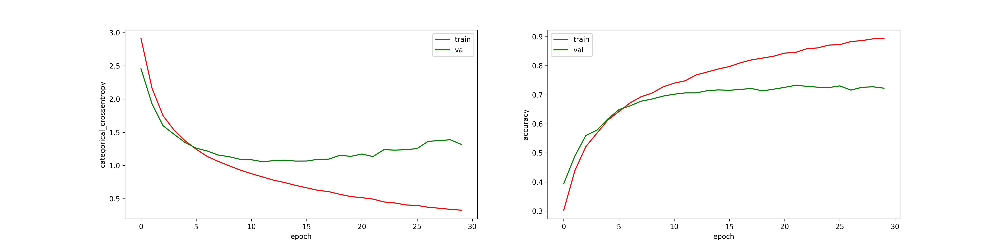

# Intent Classification test project
Implementation of an Intent Classifier model.

### About the data
Training and test data are avilable as csv files and can be found under the 
[dataset folder](dataset/). They contain a set of text sentences (*questions*)
each one labelled with respect two features: **Scenario** and **Intent**.

In the current implementation the 'Scenario' feature has not been considered,
neither in the exploratory data analysis, nor in the model training.

The exploratory data analysis of the data can be found on 
[this notebook](./notebooks/intent_classifier_eda.ipynb).

### Current model performances
The current model has been trained using a *categorical cross-entropy* loss function
and its performances can be summarized with the following table:

| Dataset        | Loss (categorical cross-entropy) | Accuracy |
| -------------- |:--------------------------------:| --------:|
| Training       | 0.755                            | 78.11%   |
| Test           | 1.079                            | 70.64%   |
 
All these performance indexes have been calculated using the weights at the 
epoch 12 of the training (the weights file can be found 
[here](model_params/intent_classifier_0012-1.05701441.h5)).
 
After this epoch the model seems to overfit the data, as shown by the following
plots: 


### The application 
The model has a simple REST API that can be accessed to get the predictions. 

The following commands allows to build, launch and query the app.

#### Build the application
Build the docker image by running the following bash command on a terminal:
```bash
docker build --no-cache -t intent-classifier-app .
```
By default the app can be accessed using the port 5000. To change this
change the `EXPOSE 5000` line in the Dockerfile.

#### Launch the application
To launch the application run the following bash command:
```bash
docker run -d --rm --network 'host' intent-classifier-app
```
The application takes few seconds to respond.

#### Get a prediction
To get a prediction open a terminal and launch the following bash command:
```bash
curl -X GET http://127.0.0.1:5000/ -d text="should I submit this input?"
```
Where the expected output has the form:
```json
{
    "intent": "query",
    "confidence": "0.798"
}
```